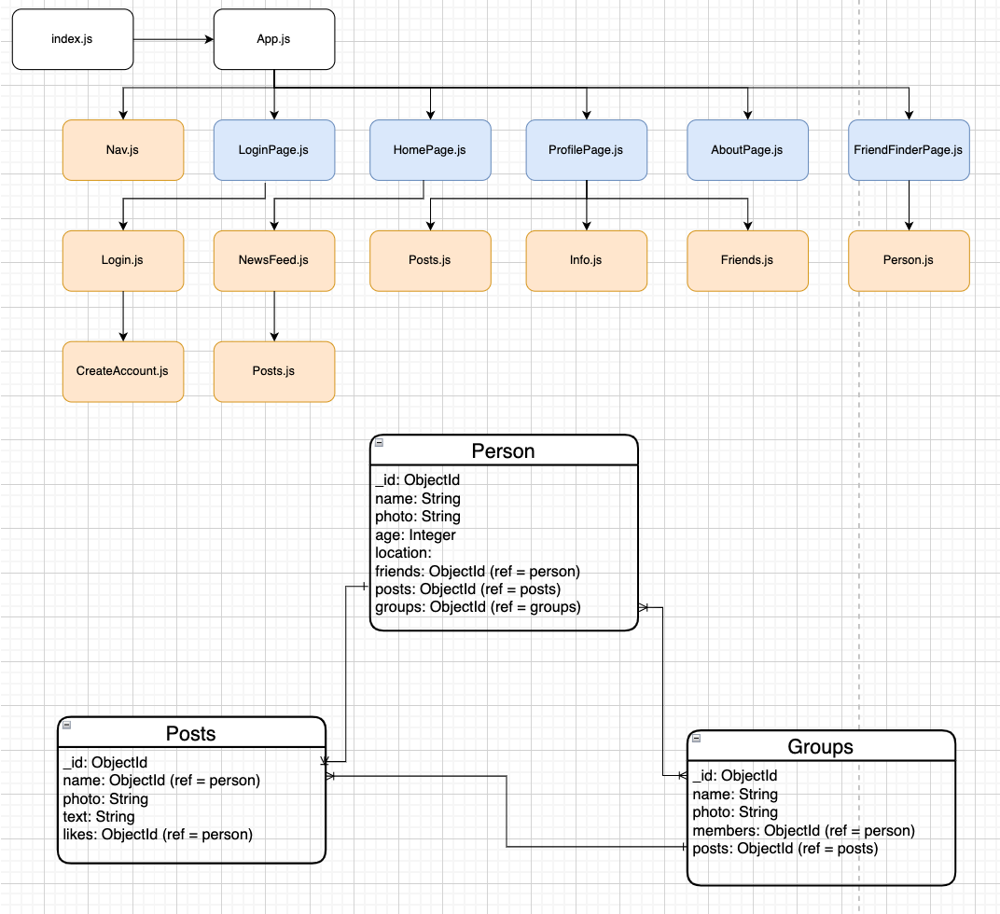
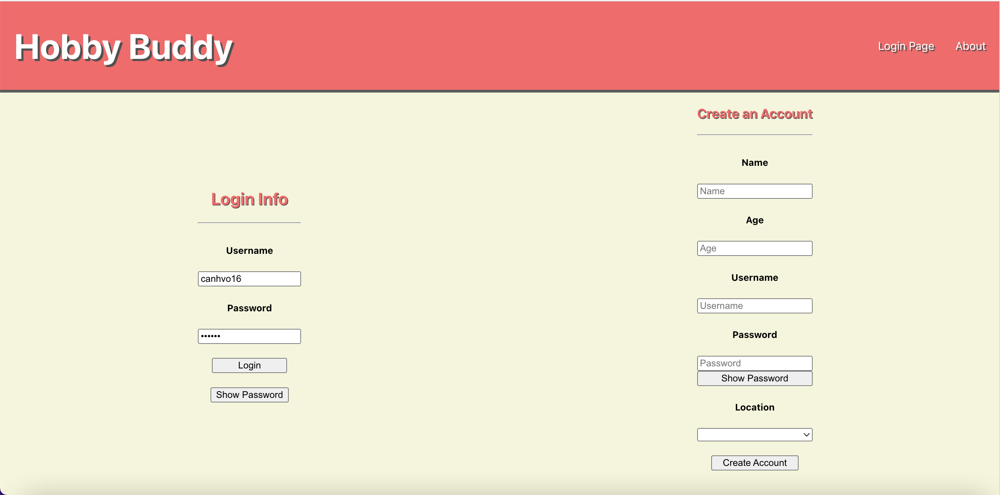
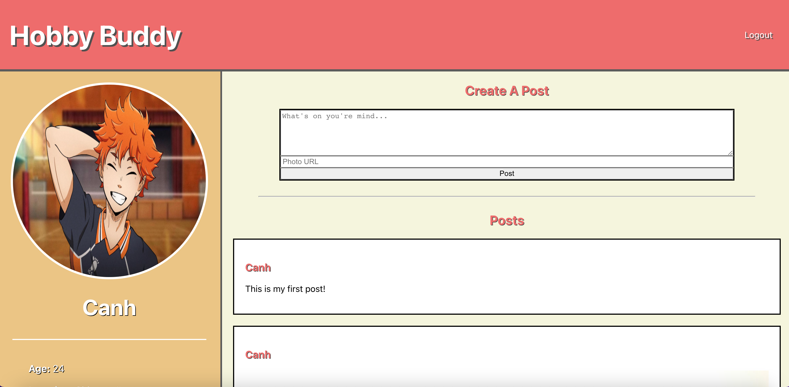

# **Hobby-Buddy**

## Date: 3/27/2022

### By: Canh Vo

### [Github](https://github.com/canhvo16) [LinkedIn](https://www.linkedin.com/in/canh-vo-056122188/) [Trello](https://trello.com/b/DCwt5p0F/hobby-buddy)

---

### **_Overview_**

#### This is my Unit 2 project where I built a functioning MERN (Mongoose/Express/React/Node) full-stack application. The idea for this project came from my younger brother who was having trouble finding friends with similar hobbies/interests. In this application, users can create a profile that lists their hobbies/interests and location to connect with each other to make friends and build a communtiy.

---

### **_Getting Started_**

- To start on this project, I will build out the backend (creating models/data) and make sure that I can retrieve the correct data with the correlating routes.
- From there, I will create my React app with a `HomePage`, `AboutPage`, `ProfilePage`, and a `FriendPage` where users will be able to search for people with similar hobbies.
- After the pages are created, I will build out the necessary components such as the `Newsfeed` where `Posts` from other users will be shown, an `Info` component that will layout a user's own personal information, and a `Person` component that will populate a user's search when looking for friends.

---

### **_Technologies_**

- MongoDB/Mongoose
- Express
- React
- Node
  - HTML, CSS, JavaScript
- Insomnia

---

### **_Screenshots_**

**Component Hierarchy Diagram & Entity Relationship Diagram**

**Login Page**

**Profile Page**

---

### **_Future Updates_**

- [ ] Let users search for other users based on location and hobbies/interests
- [ ] Have a homepage where users can see other users posts
- [ ] Have Group Pages for people with similar hobbies

---

### **_Credits_**

Images: [Google](https://www.google.com/)
